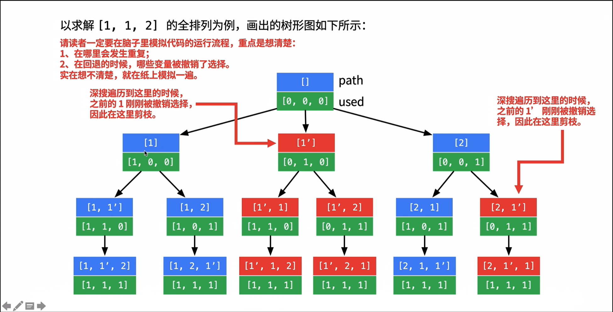

# Coding_Templates
[TOC]

## 二分搜索

-   注意点：
    -   判断用 `elif`，不用 `else `；
    -   `while` 上用 `l<=h` 预示着搜索区间为左右闭合区间 [l, h]；
    -   注意搜索左右边界时，`=` 号在那个判断条件里；
    -   注意返回值，搜索到返回相应 index，搜索不到返回 -1；


### `nums` 中搜索 `target` 

```python
def binarySearch(nums: list, target: int):
    l, h = 0, len(nums)-1
	
    # 搜索区间为 [l, h]
    while l<=h:
        m = l + (h - l) // 2
        if nums[m] == target:	###
            return m			###
        elif nums[m] < target:
            # 搜索区间变为 [m+1, h]
            l = m + 1
        elif nums[m] > target:
            # 搜索区间变为 [l, m-1]
            h = m - 1

    return -1
```


### `nums`中搜索最**左**侧`target` 

```python
def binarySearch_left_bound(nums: list, target: int):
```
Return:
        index or -1
    ```
    l, h = 0, len(nums)-1
	
```
# 搜索区间为 [l, h]
while l<=h:
    m = l + (h - l) // 2
    if nums[m] < target:
        # 搜索区间变为 [m+1, h]
        l = m + 1
    elif nums[m] >= target:
        # 搜索区间变为 [l, m-1]，'>=' 判断收缩右侧边界
        h = m - 1

return -1
```


### `nums`中搜索最**右**侧`target` 

```python
def binarySearch_left_bound(nums: list, target: int):
```
```
Return:
    index or -1
​```
l, h = 0, len(nums)-1

# 搜索区间为 [l, h]
while l<=h:
    m = l + (h - l) // 2
    if nums[m] <= target:
        # 搜索区间变为 [m+1, h]，'<=' 判断收缩左侧边界
        l = m + 1
    elif nums[m] > target:
        # 搜索区间变为 [l, m-1]
        h = m - 1

return -1
```


## 回溯

-   注意点：
    -   判断 **路径** 代表什么，**选择列表** 代表什么
    -   **我们只要在递归之前做出选择，在递归之后撤销刚才的选择**，**就能正确得到每个节点的选择列表和路径**；
    -   当存在 **重复选择** 时，用 `used` 数组记录每个选择是否被选过（此前要对选择数组做排序），参考包含重复数字的全排列题
    -   `list[:]` 表示我们要的是 list 的一个 copy；
-   

### 核心框架 

```python
for 选择 in 选择列表:
    # 做选择
    将该选择从选择列表移除
    路径.add(选择)
    backtrack(路径, 选择列表)
    # 撤销选择
    路径.remove(选择)
    将该选择再加入选择列表
```

### 全排列，无重复数字

```python
# 保存结果
res = []

def permute(nums: list):
    # 记录
    track = []
    
    # 路径：记录在 track 中
    # 选择列表：nums 中不存在与 track 中的那些元素
    # 结束条件：nums 中的元素全部都在 track 中出现
    def backtrack(nums: list, track: list):
        # 触发结束条件
        if len(track) == len(nums):
            res.append(track[:])	# 注意是 track[:]，res 保存的是 track 的副本
            return
        for i in range(len(nums)):
            # 排除不合法的选择
            if nums[i] in track:
                continue
            # 做选择
            track.append(nums[i])
            # 进入下一层
            backtrack(nums, track)
            # 取消选择（这里的选择是上上步做出来的，而不是递归函数，因为递归函数返回后不会对 track 产生影响
            track.pop()
```

### 全排列，有重复数字



```python
def permuteUnique(self, nums: List[int]) -> List[List[int]]:
    res = []
    stack = []
    l = len(nums)
    used = [False] * l	# 判断此元素是否被选择，结合排序的 nums 来剪枝
    list.sort(nums)	

    def backtrack(nums, stack, used):
        for i in range(l):
            if len(stack) == l:
                res.append(stack[:])
                return
            elif i>0 and nums[i] == nums[i-1] and not used[i-1]:
                continue
                elif not used[i]:
                    stack.append(nums[i])
                    used[i] = True
                    backtrack(nums, stack, used)
                    stack.pop()
                    used[i] = False

	backtrack(nums, stack, used)
	return res
```

### [全排列，字母大小写](https://leetcode-cn.com/problems/letter-case-permutation/)

```python
class Solution:
    def letterCasePermutation(self, S: str) -> List[str]:
        res = []
        l = len(S)
        index = 0	# 对 S 在横向上做遍历，通过 index 往后查看
        S = list(S)

        def recur(S, index):
            if index > l-1:
                res.append(''.join(S))
                return
            if S[index].isalpha():
                # 这里开始往二叉树左侧走，左侧是字母对应大写字母的情况
                S[index] = S[index].upper()
                recur(S, index+1)
                # 这里开始往二叉树右侧走，右侧是字母对应小写字母的情况
                S[index] = S[index].lower()
                recur(S, index+1)
            elif S[index].isdigit():
                recur(S, index+1)
        
        recur(S, index)

        return res
```


## 滑动窗口

-   题目形式

    -   从字符串 S 中匹配 **子串** T，匹配要用到 window 和 needs **哈希表做统计**
        -   字符串 S 的最小覆盖子串 T
        -   找到字符串 S 中所有异位词
        -   无重复字词的最长子串

-   注意点：

    -   to be done

### 核心框架

```python
left, right = 0, 0	# 两个指针从头开始

# 当 right 指针未到最后
while right < len(s):
    window.add(s[right])
    right += 1
    
    # valid 指 window 中已经包含子串 t
    while valid:	
        window.remove(s[left])
        left += 1
```

### 字符串 S 的最小覆盖子串 T

```python
S = 'ABODECODEBANC'
T = 'ABC'
left, right = 0, 0
start, minlen = 0, float('inf')
window = {}
needs = {}
# 初始化 needs
for c in T:
    needs[c] = 1 + needs.get(c, 0)

# 对比 window 中有多少个 char 满足了 needs 的要求，如果 match 等于 len(needs)，说明构成子串
match = 0	

# right 还未到 S 末尾
while right < len(S):
    cr = s[right]
    if cr in needs:
    	window[cr] = 1 + window.get(cr, 0)
        # 努力使窗口满足条件
        if window[cr] == needs[cr]:
            match += 1
    right += 1
        
    while match == len(needs):
        
        # 如果子串长度小于 minlen，更新 minlen
        if right-left < minlen:		#
            start = left			#	% 不同任务这里处理方法不同 %
            minlen = right-left		#
            
        # 子串 left 向右缩
        cl = S[left]
        if cl in window:
            window[cl] -= 1
            # 打破了窗口满足条件的情况
            if window[cl] < needs[cl]:
                match -= 1
        left += 1
        
print(S[start: start+minlen] if minlen != float('inf') else '')
```

## 双指针

-   两种双指针
    -   快慢指针（链表）
        -   判断链表是否有环
        -   找链表环的起点
        -   找链表中点（可用于链表归并排序）
    -   左右指针（数组）
        -   二分查找
        -   两数之和
        -   反转数组

### 判断链表是否有环

```python
def hasCycle(head: ListNode):
```
```
Return:
    True or False	# 表示有无环
​```
fast = slow = head
while fast is not None and fast.next is not None:
    fast = fast.next.next	# fast 每次跳 2 个
    slow = slow.next		# slow 每次跳 1 个
    
    if fast == slow:
        return True
    
return False
```


### 有环的返回环得起始位置

```python
def detectCycle(head: ListNode):
    fast = slow = head
    # 先找到 fast (2倍速) 和 slow 的第一次交点
    while fast is not None and fast.next is not None:
        fast = fast.next.next
        slow = slow.next
        if fast == slow:
            break
    
    # 将 slow 定义为 head，重新同速走，相遇为环起点
    slow = head
    while fast != slow:
        fast = fast.next
        slow = slow.next
    
    return slow
```


### 找链表中点（可用于链表归并排序）

```python
# fast 2倍速，slow 1倍速向前跑
while fast is not None and fast.next is not None:
    fast = fast.next.next
    slow = slow.next

# slow 为中点
return slow
```


### 两数之和

```python
def twoSum(nums: list, target: int):
```
```
Args:
    nums: list, 非递减序数组
    target: int，两数和
Return:
    [left, right]: 和为 target 的两数坐标，无和为 target 则返回 [-1,-1]
​```
left, right = 0, len(nums)-1
while left < right:
    nsum = nums[left] + nums[right]
    if nsum == target:
        return [left, right]
    elif nsum < target:	# 当 nsum 大于 target 时，
        left += 1
    elif nsum > target:
        right += 1
        
return [-1, -1]
```


### 反转数组

```python
def reverse(nums: list):
    left, right = 0, len(nums)-1
    while left < right:
        # 左右侧元素不断替换
        temp = nums[right]
        nums[left] = nums[right]
        nums[right] = temp
        left += 1
        right -= 1
        
    return nums
```

## 最小堆

-   注意点

    -   初始化用数组
    -   操作
        -   从上向下调整
        -   从下向上调整
        -   删除
    -   下面时最小堆，最大堆为输入时把数据取负


### 从下向上调整（向堆 heaq 中输入 num）

```python
 def upper(heaq, num):
        """min heaq"""
        heaq.append(num)
        k = len(heaq)-1
        temp = heaq[-1]
        while k>1:
            if heaq[k//2] > heaq[k]:
                temp = heaq[k//2]
                heaq[k//2] = heaq[k]
                heaq[k] = temp
            k = k//2
```


### 删除

```python
def delete(heaq):
    if len(heaq) == 1:
        return 
    top = heaq[1]	# 把堆顶元素先暂存
    k, n = 1, len(heaq)-1	# 堆顶 index 和堆最后一个元素 index
    while k<n:
        if heaq[2*k] > heaq[2*k+1]:
            heaq[k] = heaq[2*k+1]
            k = 2*k+1
        else:
            heaq[k] = heaq[2*k]
            k = 2*k
    if k//2 < n:
        heaq[k//2] = heaq[n]
        heaq.pop()
        
    return top
```

## 二叉树

- 常用思路

  - **路径**题目通常用回溯，记住上边回溯框架（路径，选择，最后弹出**栈**）
  - 
  - 层次遍历分两种情况
    - 不用记录每层
    - 要记录每层结点

- 常用技巧

  ```python
  # 搜索符合条件的 index：
  while 符合条件: p += 1	# p 就是 index
  ```

  

- 二叉树定义

  ```python
  class TreeNode:
      def __init__(self, x):
          self.val = x
          self.left = None
          self.right = None
  ```


### 递归遍历

```python
def order(root: TreeNode):
    if root:
        # visit(root)	preorder
        order(root.left)
        # visit(root)	inorder，此时左子树已经处理过，并发生变化了
        order(root.right)
        # visit(root)	postorder，此时右子树已经处理过，并发生变化了
```


### 前序 + 中序 重构二叉树

```python
class Solution:
    def buildTree(self, preorder: List[int], inorder: List[int]) -> TreeNode:
        hashmap = {}	# 存储 val 对应的 index，方便查找
        for i in range(len(inorder)):
            hashmap[inorder[i]] = i
        
        # pre_root 前序遍历根结点 index，in_left 中序遍历时当前树的左边界 index，in_right 中序遍历时当前树的有边界 index
        def recur(pre_root, in_left, in_right):
            if in_left > in_right:	# 终止条件
                return None
            root = TreeNode(preorder[pre_root])
            i = hashmap[preorder[pre_root]]
            root.left = recur(pre_root+1, in_left, i-1)
            root.right = recur(pre_root+i-in_left+1, i+1, in_right)
            return root

        return recur(0, 0, len(inorder)-1)
```


### 判断是否为二叉搜索树后序遍历序列

```python
class Solution:
    def verifyPostorder(self, postorder: [int]) -> bool:
        def recur(i, j):
            if i >= j: return True	# 只有一个结点时，符合二叉搜索树
            l = i
            while postorder[l] < postorder[j]: l += 1	# 搜索左右子树分隔点
            m = l
            while postorder[l] > postorder[j]: l += 1	# 确认右子树都大于根结点，和上一步共同确保以 postorder[j] 为根结点的树与左右子树符合二叉搜索树
            return l == j and recur(i, m - 1) and recur(m, j - 1)	# 根结点，左右子树都符合，返回 True

        return recur(0, len(postorder) - 1)
```


### 二叉树深度（层次遍历模板）

```python
class Solution:
    def maxDepth(self, root: TreeNode) -> int:
        if root is None: return 0
        queue = [root]	# 用于记录当前层结点
       	res = 0
        while queue:	# 只用于控制对树的遍历是否结束
            tmp = []	# 用于临时记录 queue 的下一层结点
            
            for node in queue:	# ⭐ 遍历 queue（当前层结点），注意和上边 while 的区别
                
                print(node.val)	# ⭐ 这里可以进行各种对当前层结点的操作
                
                # 将 queue 层结点的下一层结点放入 tmp 中，为下一层的遍历做准备
                if node.left: tmp.append(node.left)
                if node.right: tmp.append(node.right)
                    
            queue = tmp	# queue 替换成 tmp，进入下一层
            res += 1

        return res
```

## 排列组合

- 排列

  1. 全排列（[回溯](#回溯)）
     - 有重复元素
     - 无重复元素
  2. 下一个排列
  3. 第 k 个排列

- 下一个排列

  ```python
  python
  
  ```

### [第 k 个排列](https://leetcode-cn.com/problems/permutation-sequence/solution/di-k-ge-pai-lie-by-leetcode/)

```python
class Solution:
    def getPermutation(self, n: int, k: int) -> str:
        factorials, nums = [1], ['1']
        for i in range(1, n):
            # generate factorial system bases 0!, 1!, ..., (n - 1)!
            factorials.append(factorials[i - 1] * i)
            # generate nums 1, 2, ..., n
            nums.append(str(i + 1))
        
        # fit k in the interval 0 ... (n! - 1)
        k -= 1
        
        # compute factorial representation of k
        output = []
        for i in range(n - 1, -1, -1):
            idx = k // factorials[i]
            k -= idx * factorials[i]
            
            output.append(nums[idx])
            del nums[idx]
        
        return ''.join(output)
```

## 素数计算

### 小于 n 的素数个数


```python
def countPrimes(n):
    visited = [1] * n
    count = 0	
    for i in range(2, n):
        if visited[i]:
            count += 1	
            j = 2
            while i*j < n:	# 标记 合数
                visited[i*j] = 0
                j += 1
    return count
```

## 字符串

### 判断 s 是否可重构为回文串

```python
def canPermutePalindrome(s: str) -> bool:
        hashmap = {}
        for c in s:
            if hashmap.get(c, 0) & 1 == 0:
                hashmap[c] = 1 + hashmap.get(c, 0)
            else:
                hashmap[c] -= 1
            
        return sum(hashmap.values()) <= 1
```


## Reference
